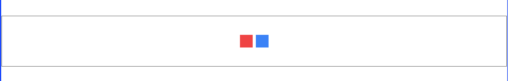
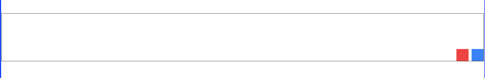
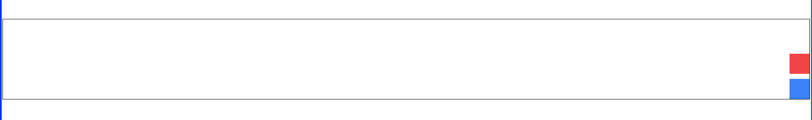
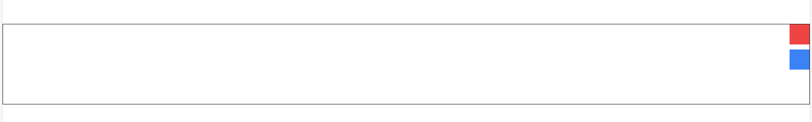
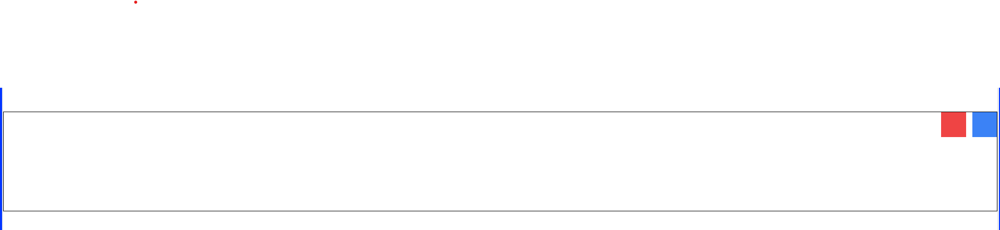

# Tarea 1

Lea cuidadosamente las siguiente instrucciones y conteste todas las preguntas.

## Instrucciones

1. Cree un fork de este repositorio en su cuenta de GitHub.
2. Navegue usando `cd` en la terminal donde quisiera descargar el código.
3. Clonee su fork en su computadora con el siguiente comando:
   `git clone <link a su fork>`
4. Cree una rama donde trabajará con sus cambios:
   `git branch <su rama>`
   `git switch <su rama>`
5. Responda todas las preguntas a continuación. Al terminar, siga los siguientes pasos.
6. Cree un commit describiendo sus cambios:
   `git add <archivos>`
   `git commit -m "<resumen de los cambios>"`
   `git push origin <su rama>`
7. Puede repetir los pasos 5 y 6 hasta terminar la tarea. Al terminar, vaya a su fork en GitHub y dele al botón para crear un Pull Request. ¡Listo!

## Preguntas

Las siguientes preguntas se realizarán en el `index.html` incluido en este repositorio.

### Parte 1

1. Cambie el título del documento para que se vea reflejado en la pestaña del navegador. Debe leerse "VLA - Tarea 1".
2. Configure Tailwind CSS usando el CDN. Debe de estar bien configurado dentro de la etiqueta según lo hemos visto en clase.
3. Cree dos botones. Uno que se llame "Botón 1" y el otro "Boton 2". Haga estos botones versen lo más astéticamente bonitos que logre hacerlos, incluyendo interacciones al levitarse sobre ellos.
4. Configure correctamente los íconos según lo vimos en clase de Material Symbols y añádele un icono distinto a cada botón.

### Parte 2

Para cada una de las siguiente preguntas, cree un nuevo div, para que se puedan ver todas las respuestas una seguida por otra. Cada respuesta debe de tener un marco al rededor de los botones con un borde blanco, se verá esto en las siguientes imágenes. Debe replicar las imàgenes, reemplazando los cuadros por los botones que crearon en la parte 1. Cada botòn debe de tener un color de fondo distinto. No se puede mover manualmente la pocisiòn de los botones, deben modificar su posiciòn ùnicamente modificando las clases.

1. 
2. 
3. 
4. 
5. 
